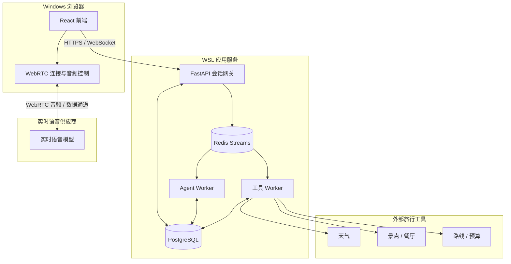
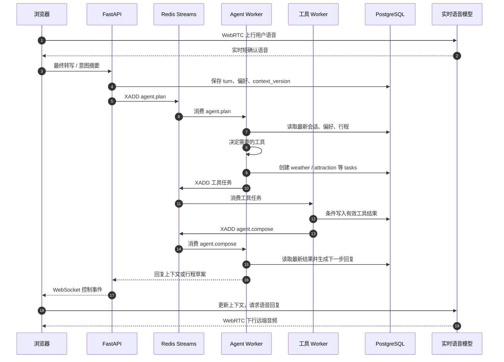
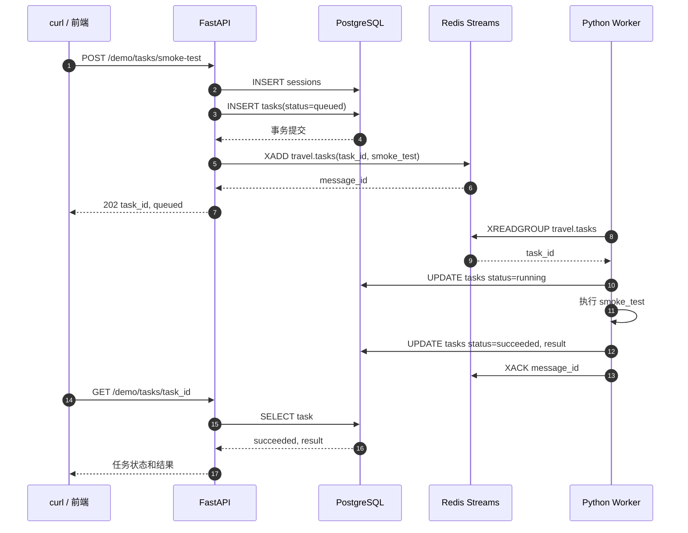
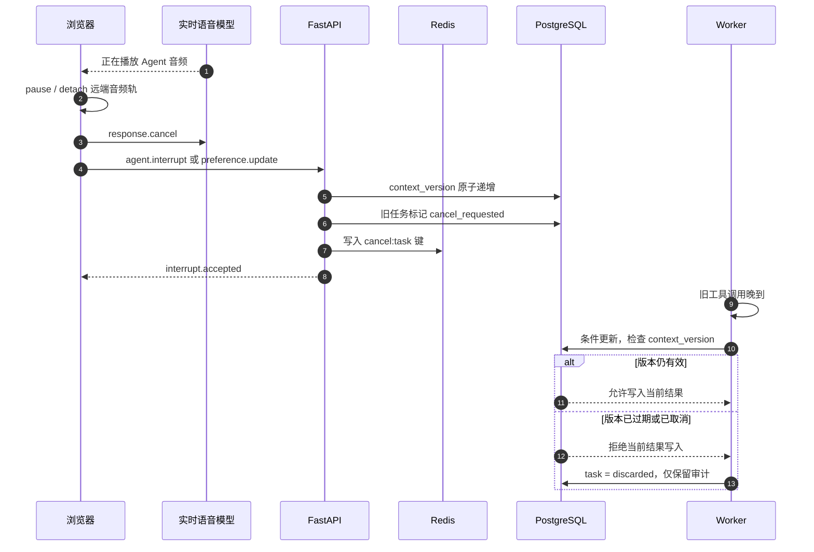
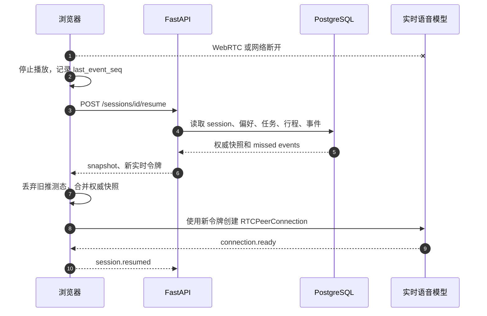
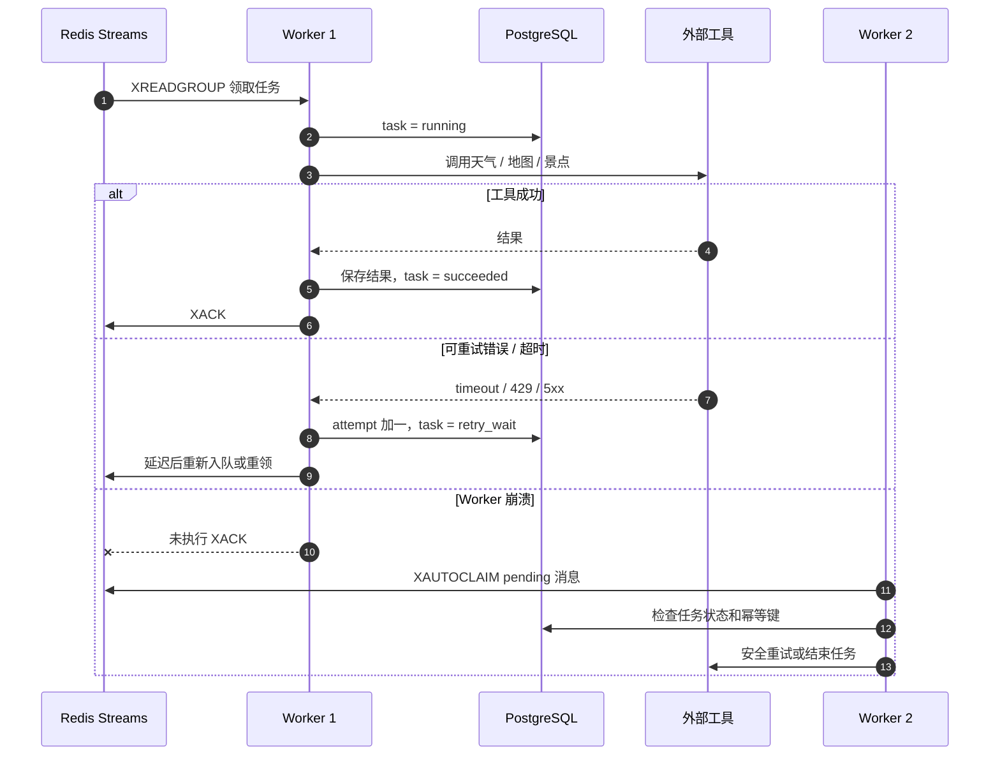
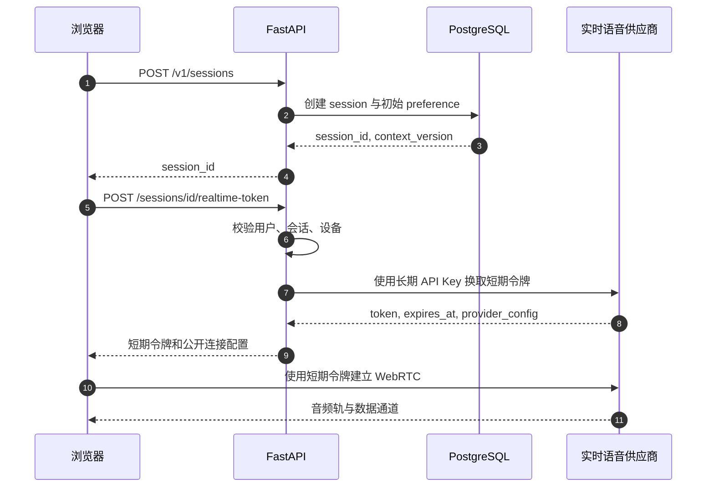
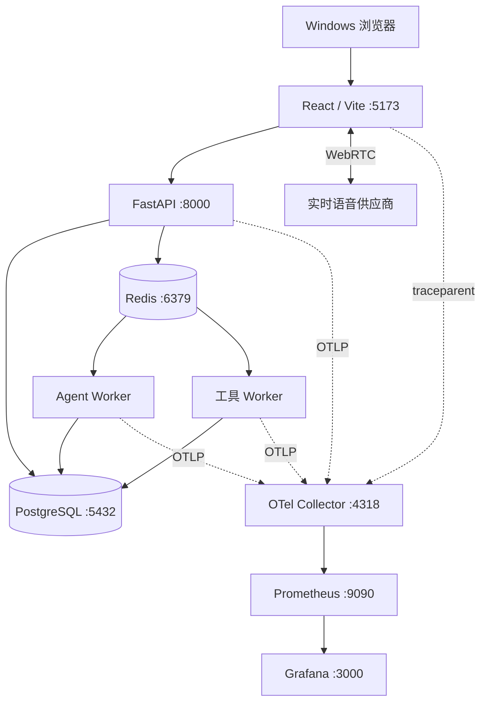

# LivePilot 系统流程图

本文以图示方式说明 LivePilot 的核心工作流、异常处理和基础设施关系。

> 当前已跑通：FastAPI 创建 `smoke_test` 任务、PostgreSQL 持久化、Redis Streams 入队、Worker 消费并写回结果。
>
> 其余流程是依据 `LivePilotInstruction.md` 规划的目标架构，需在后续阶段实现。

## 1. 系统总览

媒体面与控制面分离：浏览器直接和实时语音供应商交换 WebRTC 音频；FastAPI 不代理音频，只处理会话、令牌、任务和控制事件。

## 2. 核心业务主流程

这是用户说出旅行需求后，完成异步查询并获得下一步语音回复的正常成功路径。

## 3. 当前最小任务链路

这是当前本地已实现的 `smoke_test` 验证流程。它是未来 Agent 与旅行工具任务的最小基础。

## 4. 用户打断与旧结果丢弃

打断的第一目标是立即停止浏览器本地音频，不等待网络。随后网关增加 `context_version` 并取消旧任务；迟到结果只保留审计信息，不能覆盖当前行程。

## 5. WebRTC 或网络断开后的恢复

浏览器内的部分转写和临时播放状态不可靠。重连时以 PostgreSQL 中的权威快照为基线，并使用新短期令牌重新建立 WebRTC。

## 6. Worker 超时、失败与重试

Worker 只有在 PostgreSQL 成功提交任务终态后才确认 Redis 消息。这样即使进程崩溃，未确认消息也可以被其他 Worker 接管。

不可重试的业务错误，例如无效城市或无效日期，直接标记为 `failed`，不进行指数退避。

## 7. 创建会话与获取短期实时令牌

长期实时模型 API Key 只存在后端。浏览器只获得绑定会话、有效期很短的一次性令牌。

## 8. 部署与可观测性链路

开发期可以先运行 PostgreSQL、Redis、API、Worker 和前端。完整部署增加 OTel Collector、Prometheus 与 Grafana，使用同一个 `trace_id` 串联请求和任务。

需要追踪的重点包括：首段音频响应延迟、用户打断生效时间、队列等待时间、工具调用耗时、任务失败率、WebRTC 重连次数，以及旧任务被 `discarded` 的比例。
